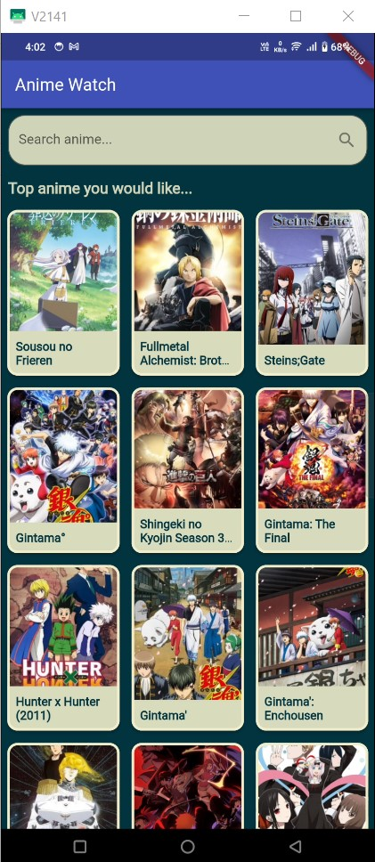
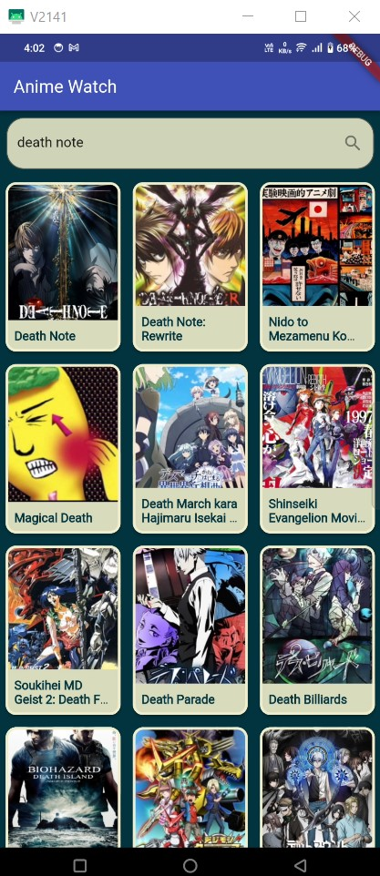
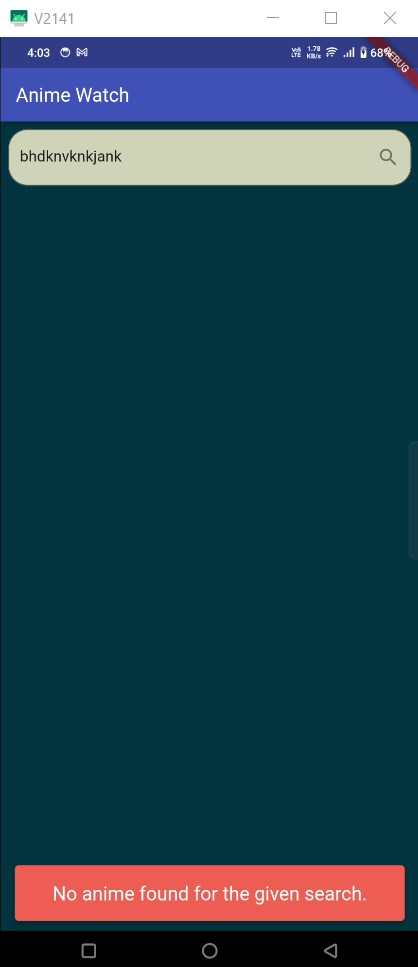

# Anime Watch

 

     
 
 
  
 

<video width="280" height="210" controls>
  <source src="

https://github.com/Akash1437/IPL-Auction-System/assets/107811139/7c1a27b0-de12-46c5-ba73-4cd713af6ce3

" type="video/mp4">

</video>

# PROJECT INSIGHTS

    1. Implemented a search bar for users to input the name of the anime they want to search for.
    2. Fetch anime data from the Jikan API using the endpoint https://api.jikan.moe/v4/anime?q=<name_here>.
    3. Display search results that showing: Anime Name,Title,URL,Trailer thumbnail (if available)
    4. Redirect users to the YouTube app or website to watch trailers when they click on a search result.
    5. Use the Flutter framework for cross-platform development.
    
 

